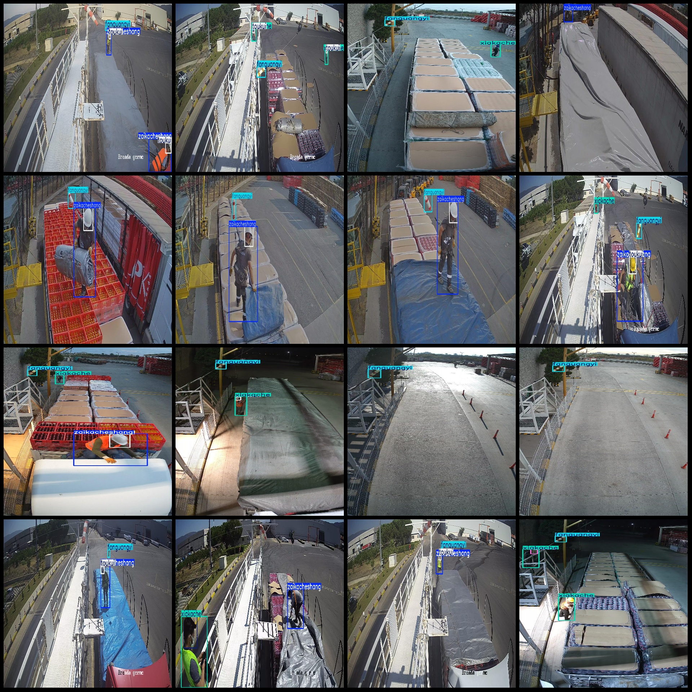
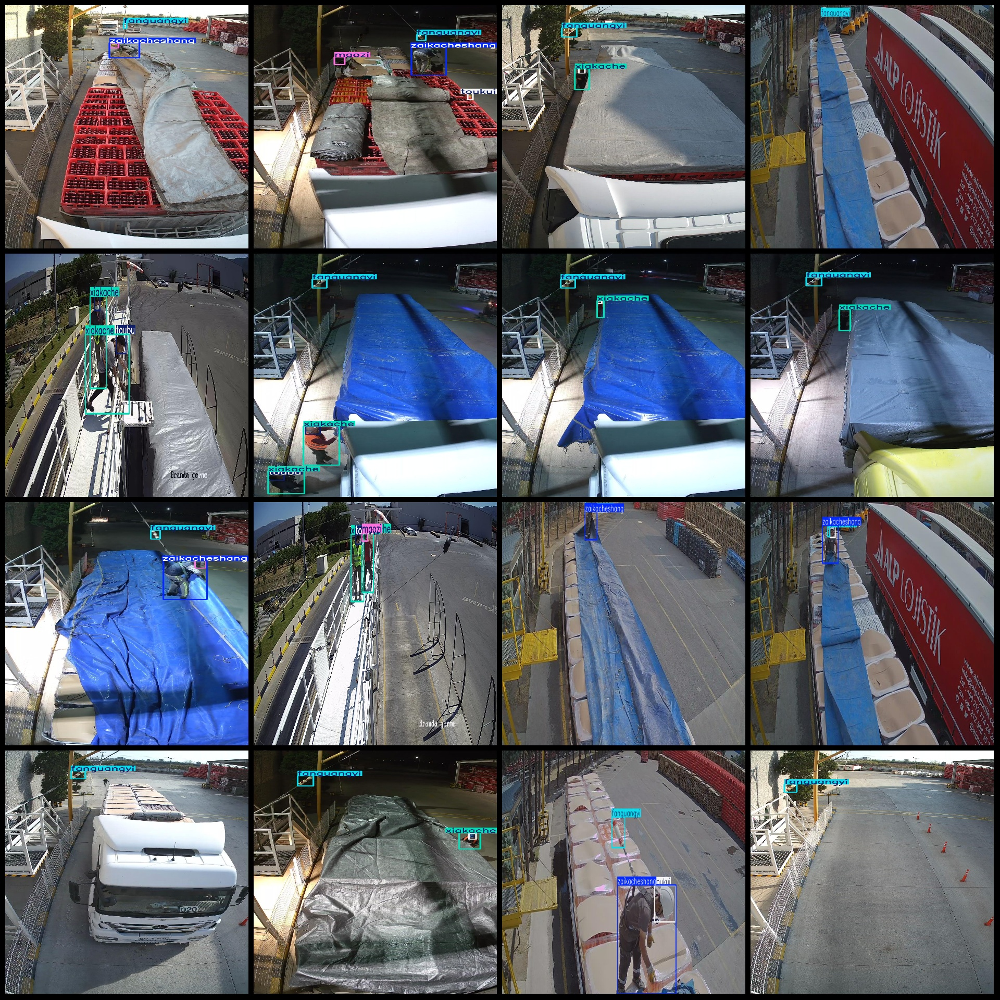

# High-definition Images of Smart Logistics Workstation Safety Helmets and Clothing Status Detection Data Set VOC+YOLO Format with 6847 Images in 6 Categories

Dataset format: Pascal VOC format + YOLO format (txt file without split path, only contains jpg images and corresponding VOC format xml files and YOLO format txt files)
The number of jpg files is 6847.
Number of XML files: 6847
Number of txt files: 6847
The number of categories is 6.
The labels are: ["fanguangyi", "maozi", "toubu", "toukui", "xiakache", "zaikacheshang"]
Headwear, Vehicle Accessories
The number of boxes labeled in each category:
Fangguangyi = 6376
Maozi frame number = 1225  
Toubu frame number = 1413
Toukui Frames = 3991
The number of boxes is 3906.
The number of frames in a ZAIGACSHANG (Zhangjiagang) is 3627.
Total box count: 20538
Number of images per category:
Fangguangyi's possession count = 6376
Maozi's possession of the image count = 1210
Toubu occupies a total of 1155 images.
Touku's possession of images = 3616
xiakache images = 3301  
Zaikacheshang's possession of images = 3404
Image resolution: 960x540
Use the labeling tool: LabelImg
Noun phrases and verb phrases should be labeled with a square box.
Important note: The dataset is not divided into training, validation, and test sets; you need to do that yourself.
Special Notice: This dataset does not guarantee the accuracy of the trained model or the weight files.
Preview of the image:
## Images

Here is a pay link on Stripe ( https://buy.stripe.com/3cs8yP7sY87d0vu9AB ). Please contact me lonlonago@foxmail.com after funding $89, and I will send you a complete data files , thank you!

